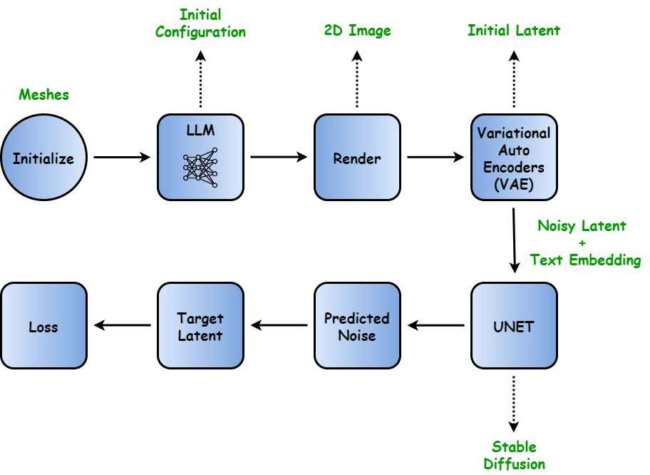
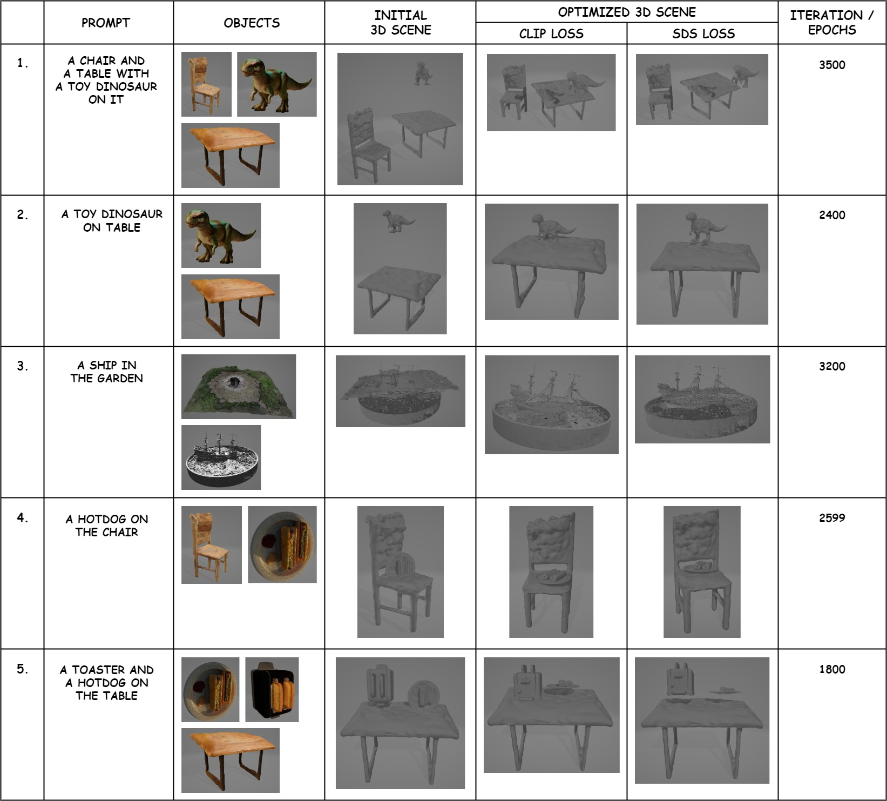
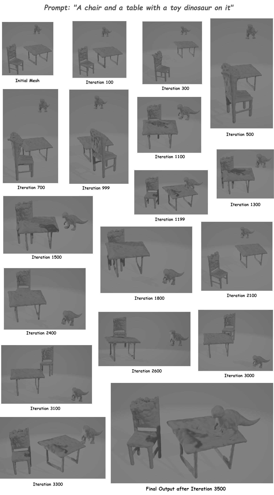

# DreamConstructorPro: Optimizing Meshes to Align with Textual Prompts

## Introduction

DreamConstructorPro is an innovative framework designed to generate compositional 3D scenes from textual descriptions. By optimizing the initial configuration of mesh objects, DreamConstructorPro leverages advanced techniques such as Contrastive Language-Image Pre-training (CLIP) Scores and Score Distillation Sampling (SDS) Loss to create detailed and accurate 3D representations.

Recent advancements in pretrained text-to-image diffusion models have enabled significant progress in text-guided 3D modeling. However, traditional holistic approaches that generate entire 3D scenes from textual descriptions face limitations, particularly for complex scenes with multiple objects. DreamConstructorPro addresses these challenges by introducing a compositional approach to 3D scene generation, leveraging GPT-4 for initial mesh configuration and optimizing these configurations using CLIP scores and SDS loss functions.



## Datasets

We utilized the Hugging Face maskngp dataset and the image-to-3D pipeline from DreamGaussian to generate individual mesh objects. Our approach builds on the baseline implementation provided by CompoDreamer, enhancing it with two novel optimization methods: CLIP score and SDS loss.

## Experiments

To evaluate the effectiveness of DreamConstructorPro, we conducted several experiments using various textual prompts. The prompts were chosen to represent a range of scenarios involving multiple objects and intricate relationships. The following prompts were used in our experiments:

- A chair and a table with a toy dinosaur on it
- A toy dinosaur on a table
- A ship in the garden
- A hotdog on the chair
- A toaster and hotdog on a table



For each prompt, the process was as follows:

1. **Text Comprehension and Initial Configuration**: The initial mesh configurations were generated by GPT-4 based on the provided textual prompt.
2. **Rendering and Initial Latent Generation**: The initial meshes were rendered into 2D images and passed through the VAE to obtain the initial latent representations.
3. **Latent Refinement with Stable Diffusion**: The latent representations were iteratively refined using a Stable Diffusion model, processed by a U-Net architecture.
4. **Optimization with CLIP and SDS**: The refined meshes were further optimized using CLIP scores and SDS loss functions to ensure alignment with the textual descriptions.
5. **Final Mesh Configuration**: The optimized latent representations were combined to achieve the final 3D mesh configurations, which were then rendered into detailed 3D scenes.

### Evaluation Metrics

The generated 3D scenes were evaluated based on their visual fidelity and semantic accuracy. The primary metrics used for evaluation were:

- **CLIP Score**: Measures the alignment between the text prompt and the rendered 2D images.
- **SDS Loss**: Evaluates the quality of the texture refinement in UV space.
- **Visual Inspection**: Qualitative assessment of the overall visual coherence and detail of the 3D scenes.

## Results and Analysis

Our experiments demonstrated significant optimization improvements for various prompts. The iterative optimization process, particularly using CLIP scores, showed superior alignment with textual descriptions in fewer iterations compared to SDS loss. However, extended training with SDS loss yielded better results for complex scenes.

The iterative optimization process resulted in noticeable enhancements in the spatial arrangement, orientation, and scaling of objects to achieve a coherent and accurate representation of the described scenes. For example, for the prompt "A chair and a table with a toy dinosaur on it," there was a significant improvement in the final mesh configuration after 3500 iterations.



Despite some challenges with complex prompts, the overall results highlight the potential of DreamConstructorPro to facilitate the creation of detailed and intricate 3D scenes from textual inputs. Further training and optimization can enhance the model's performance, especially for more intricate and detailed prompts.

## Environment Setup

This repo may requrie the following packages:

- torch
- pytorch3d
- open3d
- imageio
- scikit-image

## Run

```
python main.py
```

## Credits and Contribution:
1. Amritansh: I wrote the MeshTextureOptimizer.py and modified utils.py. Run experiments on multiple prompts.
2. Vara Prasad: I wrote the code in rendered_utils.py and modified other parts of code in differentiable_object.py. Run experiments on multiple prompts.
3. Manas: I wrote the code in Score_Distillation_Sampling.py, i.e. our SDS pipeline.
4. Priya: I wrote the code in CameraCreator.py and contributed to the report, and PPT.

Despite the specific tasks assigned, there was equal collaboration with each member helping others when encountering errors, ensuring we maintained a high level of teamwork and understanding throughout the project.

5. Baseline code from [CompoDreamer]([https://duckduckgo.com](https://github.com/justin871030/CompoDreamer))

## Source Code and Additional Attachments
- [Source Code Repository](https://github.com/amritansh6/DreamConstructorPro)
- [Additional Attachments](https://drive.google.com/drive/folders/your-drive-link)
